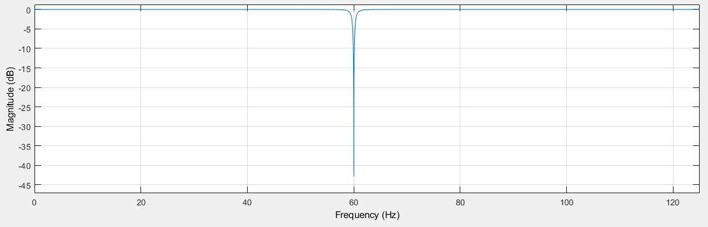
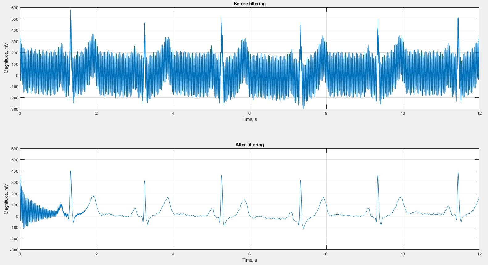
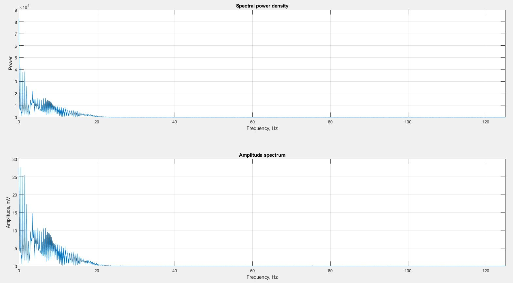
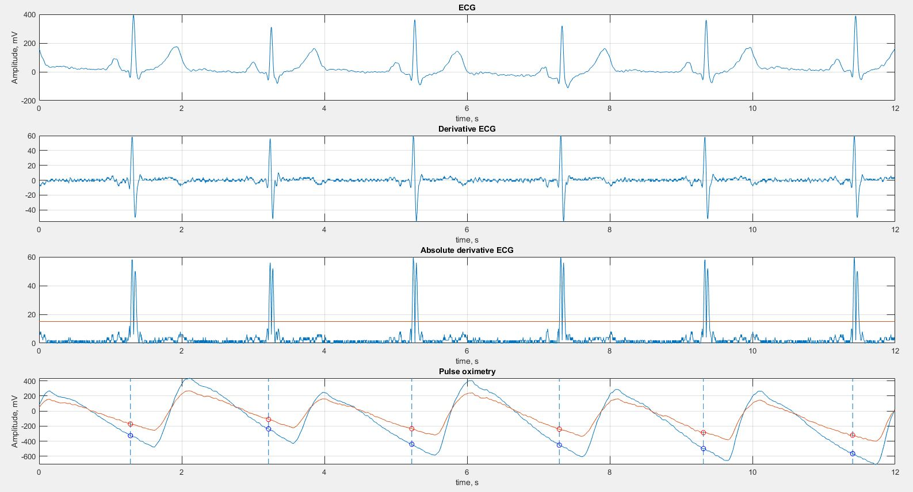
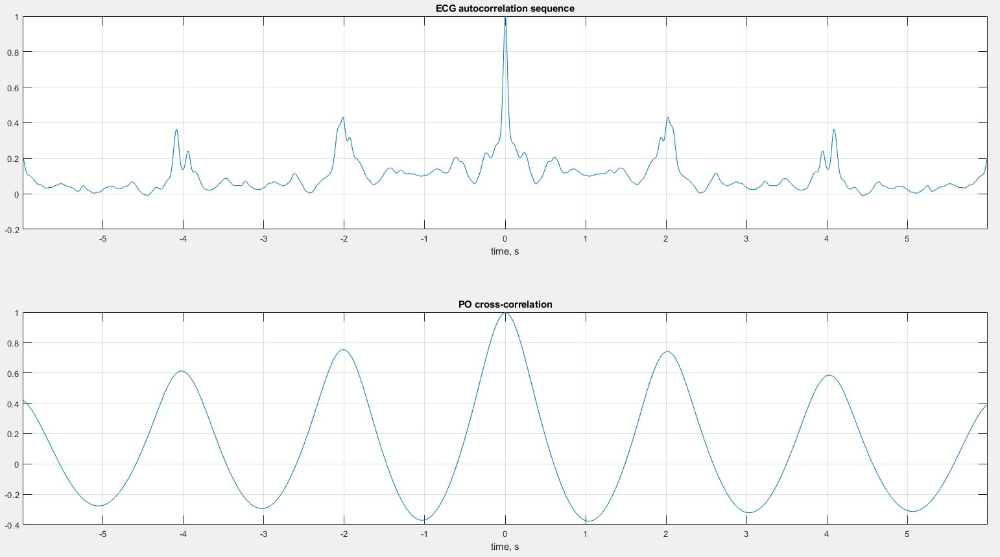
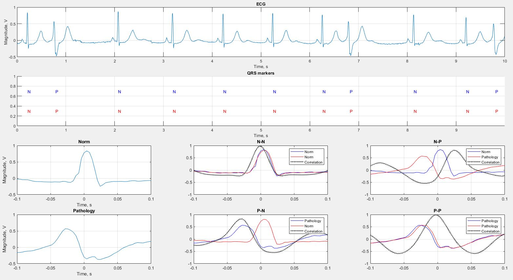

# ECG Processing

## About repository

<b>ECG Processing</b> contains different methods for processing electrocardiosignal using MATLAB

## Methods

### Filter
The

## Screenshots

  
   

  
   

  
   

